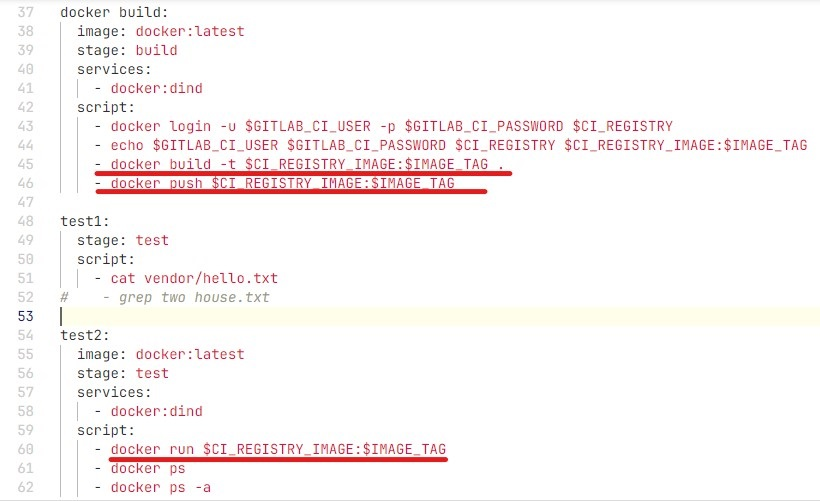
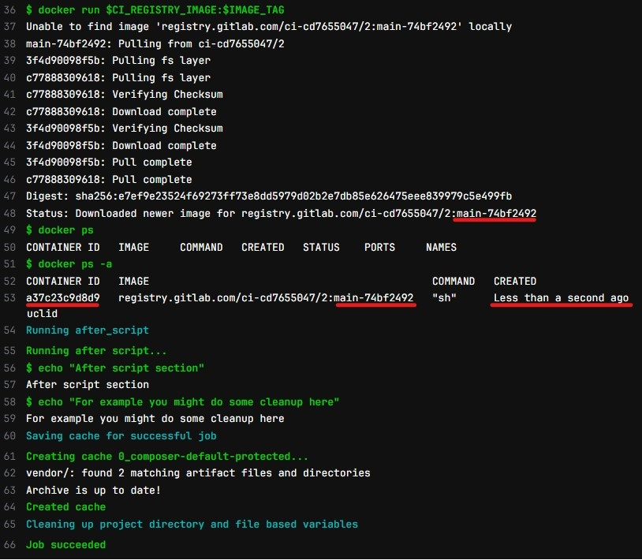

# Домашнее задание по Уроку 2 Continuous integration (непрерывная интеграция)

**Задача - переписать test stage, чтобы проверить, что docker контейнер на базе нашего собранного образа в предыдущей job запускается**

**Решение**

**Вывод джобы**

